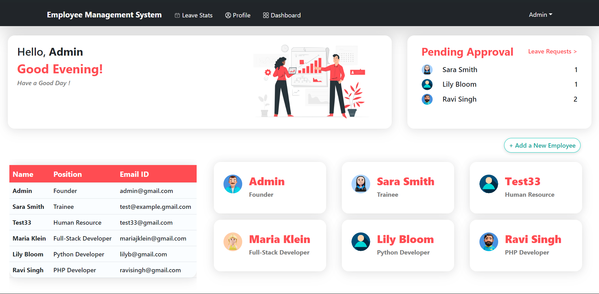

# Employee Management System 
 
This is an Employee Management System (EMS) web app. It has been adapted to use SQLite (via Sequelize) for local development instead of MongoDB. The frontend is React (Create React App), the backend is Node/Express.

## Features

### Authentication
- Users can log in using their username and password.
- Accessible only by super admin, the sign-up page allows the creation of new users with specific details such as email, name, password, date of joining, position, Aadhar card number, and PAN card number.

### Profile Management
- Users can edit their username and password.
- Users can upload a profile picture.

### Leave Management
- Normal users can apply for leave and view their leave history.
- Super admin can view, approve, and reject leave requests from all users.

### Employee Management
- Normal users can view and edit their own profiles.
- Super admin has access to a list of all employees and can edit their data.

### Dashboard
- Displays relevant information for all users.
- Shows who is on leave today.
- Provides a summary of total employees and their designations.

## Technologies Used

- SQLite (via Sequelize): Local database for storing user and employee data.
- Express.js: Backend framework for handling server-side logic.
- React: Frontend library for building user interfaces.
- Node.js: JavaScript runtime for building server-side applications.
- Ant Design & React-Bootstrap: UI library for building sleek and responsive user interfaces.
- Chart.js: Library for creating interactive and customizable charts and graphs.

## Dashboard



## Profile Page


## Installation

1. Clone the repository:
   ```bash
   git clone https://github.com/LokeshYadav24/NodeAssessment.git
   cd NodeAssessment
   ```
2. Install dependencies for both frontend and backend:
   ```bash
   cd backend && npm install
   cd ../frontend && npm install
   ```
3. Run the application:
   - Start the backend server (SQLite DB file will be created automatically):
     ```bash
     npm start --prefix ./backend
     ```
   - In a separate terminal, start the frontend development server:
     ```bash
     npm start --prefix ./frontend
     ```

## Usage

- Access the application in your browser at `http://localhost:3000`.
- The backend runs on `http://localhost:5000` and the frontend proxies API calls there.

### Demo credentials
- Super Admin
  - Email: admin@ems.local
  - Password: Admin@12345
- Normal User
  - Email: user@ems.local
  - Password: User@12345

Use the Super Admin account to add/edit users and approve/reject leave requests. Use the Normal User account to apply for leave and view profile.

## Contributing

Contributions are welcome! If you find any issues or have suggestions for improvements, please open an issue or create a pull request.
